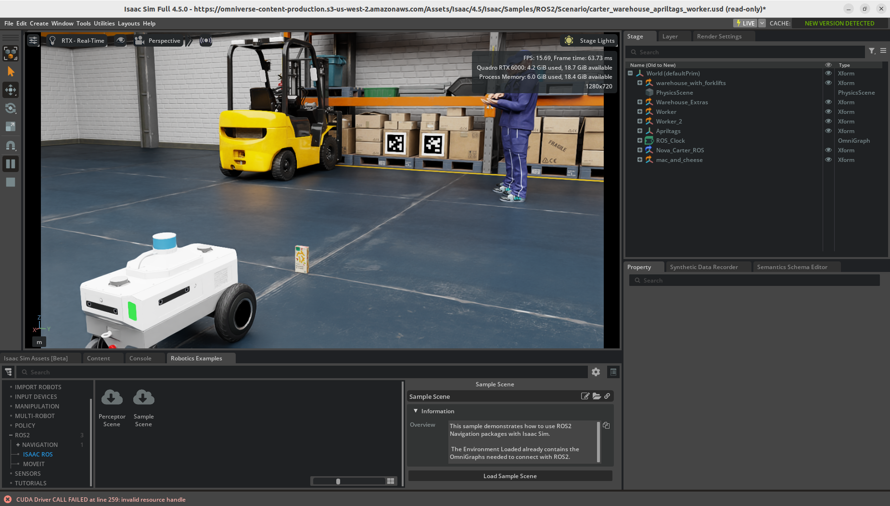
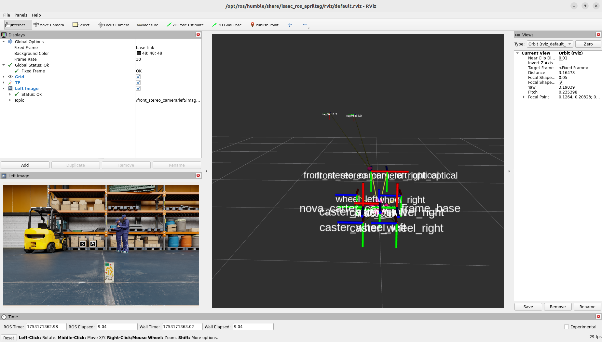

# Docker Modules

## Robot Operating System 2 (ROS 2)

ROS 2 Humble Apt Install.

## CUDA Toolkit

CUDA Toolkit 12.6 Deb Install.

> This is often unnecessary when only Python is used, as `pip install torch` typically installs the appropriate version of the CUDA Toolkit automatically.

## Isaac Sim

Isaac Sim 4.5.0 Binary Install.

Depends on:

- Vulkan Configuration
- Username

> Note that CUDA Toolkit is not required for Isaac Sim.

Compatibility test:

```sh
cd ~/isaac-sim-comp-check
./omni.isaac.sim.compatibility_check.sh
```

Quick test:

```sh
cd ~/isaacsim
./python.sh standalone_examples/api/isaacsim.core.api/time_stepping.py
# or
./python.sh standalone_examples/api/isaacsim.core.api/simulation_callbacks.py
```

Launch GUI:

```sh
cd ~/isaacsim
./isaac-sim.sh
```

> **On Host**:
> 
> Quick test using official Docker image:
> 
> ```sh
> scripts/docker_run_official_isaac_sim.sh
> ```

### Importing URDF

`File > Import` and select the URDF file.

If your URDF file is in the Xacro format, you may need to convert it to the URDF format first:

```sh
XACRO_FILE=<XACRO_FILE>.xacro
URDF_FILE=<URDF_FILE>.urdf
xacro $XACRO_FILE > $URDF_FILE
```

You can also check the URDF hierarchy:

```sh
check_urdf $URDF_FILE
```

> Note: URDF files are often not self-contained and may reference additional resources within their ROS package. For successful import, consider downloading/moving the entire package (such as the `<ROBOT_NAME>_description` directory) along with the URDF file. Otherwise, the import will fail.

## Isaac Lab

Isaac Lab 2.1.0 Git Install.

Depends on:

- Vulkan Configuration
- Username
- Isaac Sim

> Note that CUDA Toolkit is not required for Isaac Lab.

[Quick test](https://isaac-sim.github.io/IsaacLab/main/source/deployment/docker.html#running-pre-built-isaac-lab-container):

```sh
cd ~/IsaacLab
./isaaclab.sh -p scripts/tutorials/00_sim/log_time.py --headless
# View the logs and press Ctrl+C to stop
```

[Train Cartpole](https://isaac-sim.github.io/IsaacLab/main/source/overview/reinforcement-learning/rl_existing_scripts.html):

```sh
cd ~/IsaacLab
./isaaclab.sh -p scripts/reinforcement_learning/rl_games/train.py --task=Isaac-Cartpole-v0 --headless
# or
./isaaclab.sh -p scripts/reinforcement_learning/rsl_rl/train.py --task=Isaac-Cartpole-v0 --headless
# or
./isaaclab.sh -p scripts/reinforcement_learning/skrl/train.py --task=Isaac-Cartpole-v0 --headless
```

> **On Host**:
> 
> Quick test using official Docker image:
> 
> ```sh
> scripts/docker_run_official_isaac_lab.sh
> ```

## Isaac ROS

> Note: This is a work in progress. Currently only the base Isaac ROS is installed. Running examples requires additional dependencies that are not yet included in this setup.

Isaac ROS 3.2.

Depends on:

- ROS 2 Humble
- CUDA Toolkit
- and more...

### Setup

On host:

1. Edit `~/template_ws/docker/compose.yaml` to set `CUDA_TOOLKIT_VERSION: "12.6"` and `ISAAC_ROS: "YES"`.
2. Re-build the docker image with `docker compose build`.

The remaining steps should all be executed within the docker container.

### Isaac ROS AprilTag

Follow the [Quickstart](https://nvidia-isaac-ros.github.io/repositories_and_packages/isaac_ros_apriltag/isaac_ros_apriltag/index.html#quickstart) and [Isaac Sim](https://nvidia-isaac-ros.github.io/concepts/fiducials/apriltag/tutorial_isaac_sim.html) tutorials.

Install Isaac ROS AprilTag package and examples:

```sh
sudo apt-get install -y ros-humble-isaac-ros-apriltag
sudo apt-get install -y ros-humble-isaac-ros-examples
```

Start the pre-composed pipeline:

```sh
ros2 launch isaac_ros_apriltag isaac_ros_apriltag_isaac_sim_pipeline.launch.py
```

In another terminal, launch Isaac Sim:

```sh
~/isaacsim/isaac-sim.sh
```

Click `Window > Examples > Robotics Examples`. In the `Robotics Examples` window, select `ROS2 > Isaac ROS > Sample Scene` and click `Load Sample Scene`. After the scene loaded, click the `Play` button to start the simulation.

In another terminal, launch RViz:

```sh
rviz2 -d $(ros2 pkg prefix isaac_ros_apriltag --share)/rviz/default.rviz
# or
ros2 topic echo /tag_detections
```





For further info, see more tutorials in [the official documentation](https://nvidia-isaac-ros.github.io/repositories_and_packages/isaac_ros_apriltag/isaac_ros_apriltag/index.html#try-more-examples).
